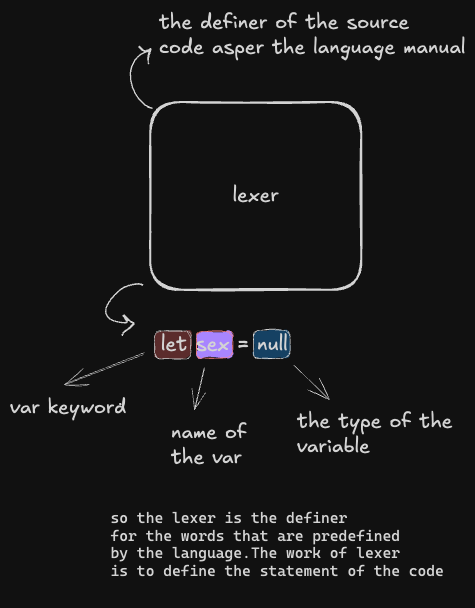
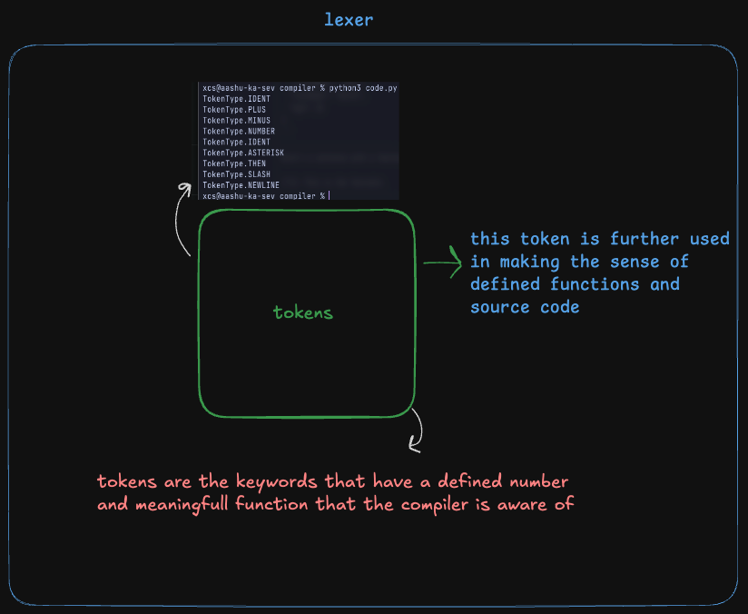
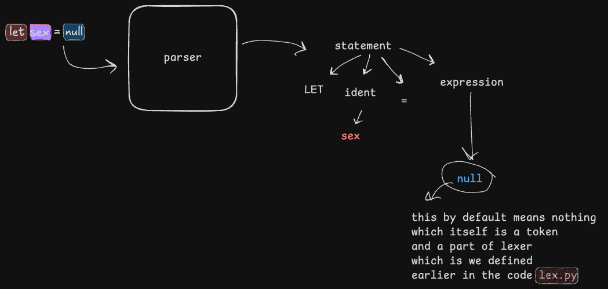

# Learning A Compiler 

so got my hands into a blog by austin henley i dont know much about him but as far as i am concern pretty good blog that is 

the blog covers alot of stuff that is kind of understandable as that is how i preassumed and theoritically taught about the thought process of a compiler and the happenings.This blog in what ways covers the technical terms for the things i want to make 

###### GOAL: is to make a c compiler using c 

so here is the content it will be updated regularly as per my learnings 

##### **TABLE OF CONTENT** 

[Lexer](#lexer)

## The Thought Process Of Compilers 
the compilers are commanded to thought in a liner way unlike the interpreters they are just modern philosophers but the compilers are the ogs they defied computational logic for you in the liner manner 

so the compilers is consist of mostly three major component referring to the blog i follow 
drawn by me in this excalidraw sheet 

### Lexer
A Lexer is basically the callout guy it is gonna call of the predefined identified keyword of the language and tell the compiler that this is what the source means to do and work like 

now something that the Lexer does to the source code is creating tokens of the keywords and user defined words  

#### Tokens 
just like in the example while explaining the lexer figure 
`let sex = null`  
keyword is `let` the `sex` is the user defined variable name and `null` is the pre defined keyword to describe the void in the variable 

tokens are defined in lexer and the lexer will identify the defined tokens 

while coding the tokens the and providing the values i got curiosity of random token values progressive toward what their purpose is 

so with that question i did some ai with the problem and this is what gemini said to me 
**NO** okay 

being too curious isnt gonna get me anywhere for sure 

will continue learning the sting part of it currently it has an error in the code will fix that too

9 , sept 26 
while making of the tokens i realised some tokens in order to make the language morden you will have to define them extincive also which makes me realise can we make a self hosting language which is gonna make me make a self hosting langugae 

well the tokens are done the commit is there now i will continue making a parser 

##### conclusion for Tokens/Lexer 
the ability and part of the compiler that can read the full phrases and make a meaning out of it and identify the various things that it can do is really amazing as i used to think the compiler parse through the source code and try making sense out of the parsed indivisual variable as now i can clearly see how the lexer can be used to identify the tokens and the type of it which can help the compiler to make sense out of it now lets move to the parser 

### Parser
oh new discovery austin says parser is the syntax checker so i had a false asumption of parser being the converter of the source code into the character stream 

here is a self drawn fig under to understand it better 

soo in this small ass figure of the code. figure it out with your teeny tiny eyes (no asian referrence btw i was talking about my own eyes).well you can clearly see that this is like your GF (a grammar corrector for the language) this will check the syntax in the grammaticall context of the language 